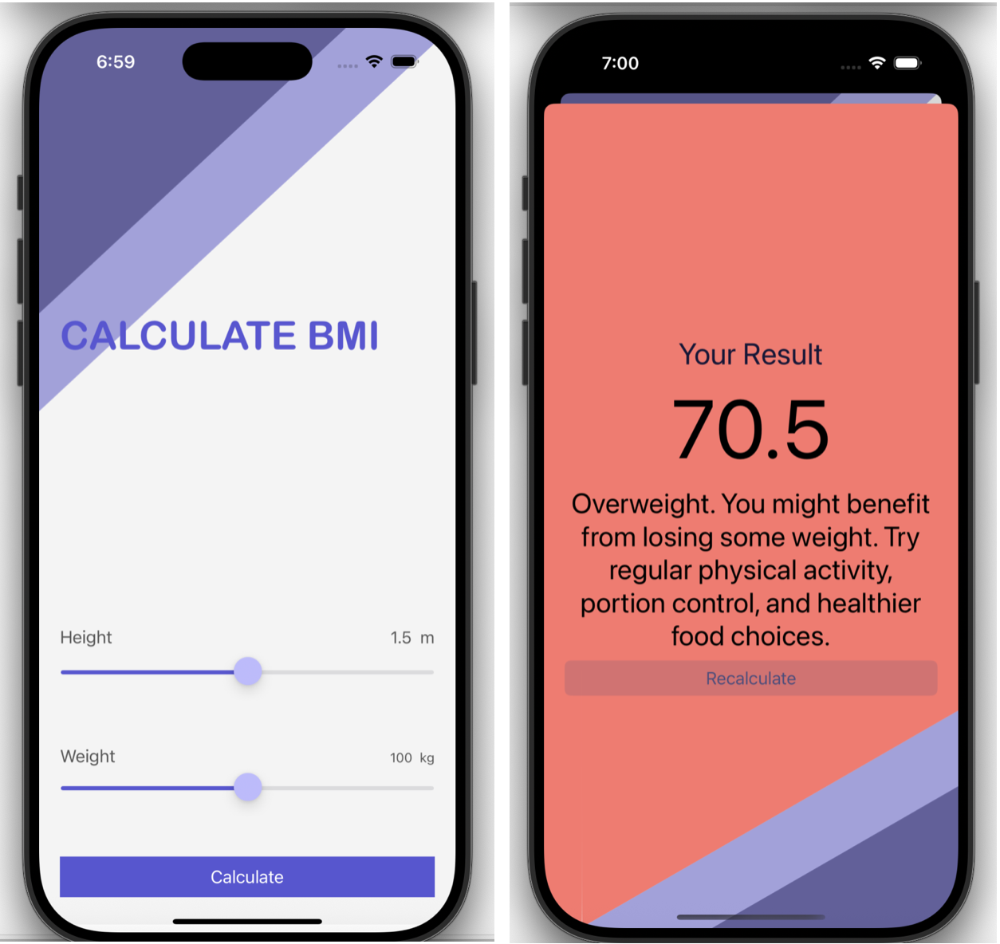

# ⚖️ BMI Calculator

An interactive iOS application that calculates the Body Mass Index (BMI) based on user input. The app provides personalized advice and visual feedback through color-coded backgrounds.
## Preview 
 
## 🩺 Features

- Input height and weight to calculate BMI
- BMI classification: Underweight, Normal, Overweight
- Dynamic background color and advice label
- Modular MVC structure
- Clean and intuitive UI

## 🛠️ Technologies Used

- **Language**: Swift
- **UI Framework**: UIKit
- **Design Pattern**: MVC (Model-View-Controller)
- **IDE**: Xcode

### Prerequisites

- macOS with Xcode (v13 or above)
- iOS simulator or physical device
